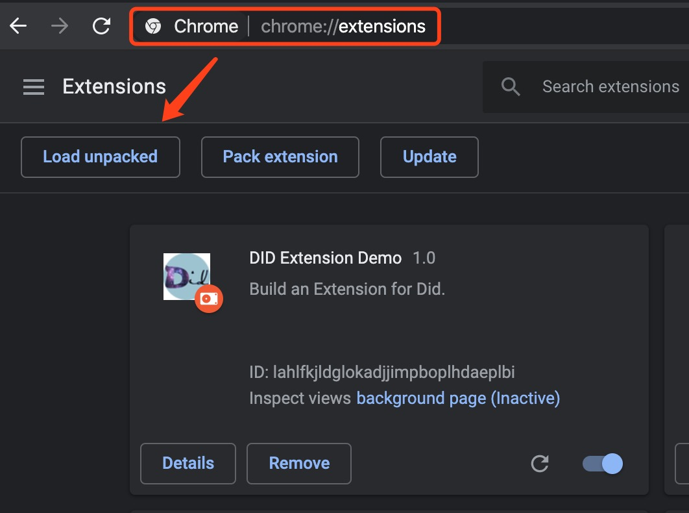

## setup the extensions

### 1. down load the code from git
```gitexclude
git clone git@github.com:LiveRamp/did_extension_demo.git
```

### 2. Open the chrome extensions
```html
chrome://extensions/
```

### 3. Load unpacked from code

